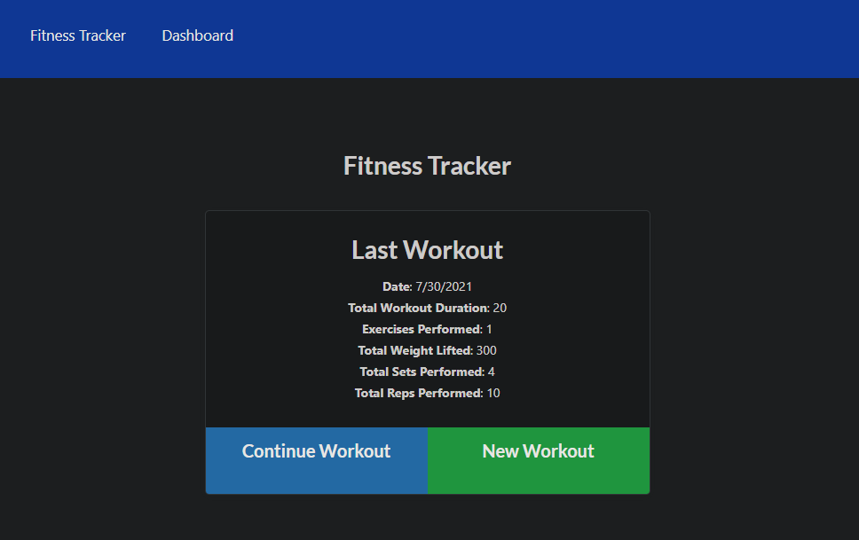
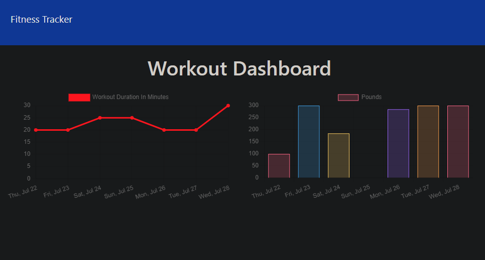

# Unit 18 Nosql Homework: Workout Tracker

For this assignment, you'll create a workout tracker. You have already been provided with the front end code in the `Develop` folder. This assignment will require you to create Mongo database with a Mongoose schema and handle routes with Express.

## Description
This is an application that lets a user track their fitness data for the past week. They provide information of their exercises such as the name, type, weight, sets, reps, and duration of their workout. Then are able to see their last workout and a line and bar graph depicting pounds and duration.

## Usage
If running locally..

`npm install`

`npm run seed` (optional)

`npm run start`

## Business Context

A consumer will reach their fitness goals more quickly when they track their workout progress.

## Deployed link

## Screenshot

